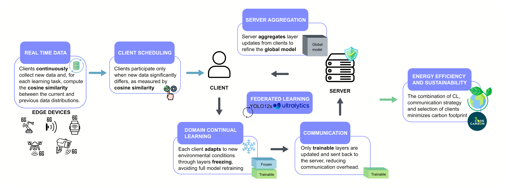

# FEDCOM: FEDerated Communication-efficient Object detection Model

##  Abstract

## Overview
## Data Availability
Datasets employed in this work are from various free available sources.  We selected the following 11 image datasets representing various fruits and assigned each type of fruit to only one client, to simulate a non-IID scenario.
Below is the list of datasets used in the experiments:

- **[Cherry tomato images in the greenhouse](#)**  : five types of cherry tomato labeled images in the greenhouse.
    
- **[Tomato Plantfactory Dataset](#)** : comprises 520 images of the Micro tomato variety, captured at two different resolutions and at two stages of fruit growth. The images were acquired under artificial light and present various complexities, including variations in perspectives, lighting quality, distance, and occlusions and blurs of the fruits, resulting in a total of 9112 instances, including 5996 green fruits and 3116 red fruits.
    
- **[LaboroTomato Dataset](#)** : images of tomatoes in various stages of ripening, acquired at a local farm, utilizing two cameras, each contributing to varying resolutions and image quality. The dataset consists of 804 images with 10610 labeled objects.

- **[tomatOD: Tomato Fruit Localization and Ripening Classification](#)** : consists of 277 images with 2418 annotated tomatoes.
    
- **[Embrapa Wine Grape Instance Segmentation Dataset (Embrapa WGISD)](#)** : 300 RGB images showing 4432 grape clusters of five different grape varieties captured in the field, exhibiting variations in grape pose, illumination, focus, and genetic and phenological characteristics such as shape, color, and compactness. The images were captured at the Guaspari Winery in São Paulo, Brazil, using a Canon EOS REBEL T3i DSLR camera and a Motorola Z2 Play smartphone.

- **[A dataset of grape multimodal OD and semantic segmentation](#)** : 3954 labeled image samples are extracted from high-quality multimodal video stream data of green and purple grapes, including six varieties, under different illumination and obscuration conditions.
    
- **[Grapes dataset Computer Vision Project](#)** : 425 images of grapes (ripe, unripe, rotten, spotted, and picking point).
    
- **[Strawberry Dataset for Object Detection](#)** : 813 images with 4568 labeled objects belonging to 3 different classes (ripe, peduncle, and unripe).
    
- **[StrawDI: The Strawberry Digital Images Data Set (StrawDI\_Db1)](#)** : 8000 images of strawberries, taken from 20 plantations, within an approximate area of 150 hectares, in the province of Huelva, Spain.
    
- **[Strawberry-DS](#)** : 247 RGB digital images of strawberry fruits taken at the Central Laboratory for Agricultural Climate (CLAC), Agricultural Research Center, Cairo, Egypt. The images were captured from the fruit top view, considering different view angles using a Sony Xperia Z2 LTE-A D6503 smartphone 20.7 MP camera. The images contain both fully and partially visible strawberry fruits.
    
- **[Strawberry.00 Computer Vision Project](#)**  : 450 strawberry images.

## Acknowledgments
